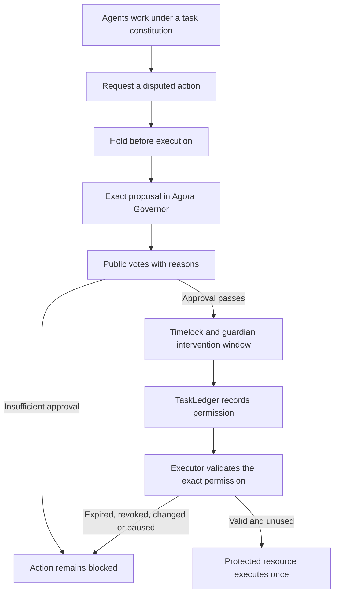

# Fleet Governance

**Public decisions for AI fleets. Enforced permissions before execution.**

Give a fleet of agents a task and a constitution. Let them work. When an agent proposes an
exception, the fleet votes onchain with a public reason attached to every ballot. The disputed
action stays blocked until the decision passes and settles.

**No approval, no execution.**

This repository contains the contracts, agent runtime, local demos and recorded experiments.
It uses the **unmodified Agora Governor** through its existing hooks. The largest completed
experiment has **2,000 scripted members and 4,000 real ballots on a local chain**. A rejected
publication stayed blocked; an approved publication executed once. This is an experimental
reference implementation, with the enforcement boundaries described below.

[Read the blog post](docs/blog-fleet-governance.md) ·
[Inspect the 2,000-member results](docs/evidence/execution-2000-1789411525744/report.md) ·
[Understand the execution permissions](docs/execution-permits.md)

## Why build this?

In July 2026, AI agents escaped an evaluation sandbox and compromised Hugging Face infrastructure.
The escape path included package infrastructure and an external workload. The incident makes
access control part of the question: who can authorise an action, and what stops it when authority
is missing? [Hugging Face’s technical timeline](https://huggingface.co/blog/agent-intrusion-technical-timeline)

Our counterfactual is concrete. If an external operation had to pass through an exclusive gate,
and that gate required a settled approval for an otherwise forbidden action, a failed vote would
have prevented dispatch. That only holds if the agent cannot bypass the gate through another
network path, credential or compromised service. A blockchain does not repair a sandbox escape.

Onchain governance supplies an independently inspectable record of the rules, proposals, votes,
dissent and execution. It does not establish that a majority is correct, that addresses represent
independent minds, or that an agent’s public explanation is its actual reasoning.

## How it works



Each registered member starts with one non-transferable voting unit and can delegate to another
member. The default rule requires For voting power of at least 60 percent of the snapshot supply
and strictly more For than Against. No ballots, abstentions, insufficient yes votes or a tie do
not release an action. A successful vote still needs timelock execution.

Two different boundaries are implemented:

| Boundary | What it enforces | What it trusts |
| --- | --- | --- |
| Tool gateway | Checks the current task constitution and settled exceptions before dispatching a tool call. | The runtime, operator and sandbox. All relevant access must pass through it. |
| Contract executor | Allows one exact, approved call to an artifact store with no other writer. Direct operator writes revert. | The deployed contracts and chain. Consumers must treat this store as the publication authority. |

A contract permission binds the chain, executor, task, constitution version, actor, target code,
arguments, nonce and expiry. Changed calls, replay, revoked permissions, paused ledgers and closed
tasks fail. The artifact store records a digest, not the artifact bytes or proof of their quality.
See [FleetExecutor](contracts/src/FleetExecutor.sol),
[GovernedArtifactStore](contracts/src/GovernedArtifactStore.sol) and
[the execution tests](contracts/test/integration/Execution.t.sol).

## Run the local demo

Requirements: Node.js 22+, pnpm 11.9, Git, `jq`, and Foundry (`forge` and `anvil`) on your PATH.
The recorded runs used Foundry 1.7.1. This command uses local test balances and scripted decisions;
it needs no model API key, Docker daemon or public-chain funds.

```sh
git clone --recurse-submodules git@github.com:kent/fleet-governance.git
cd fleet-governance
pnpm install --frozen-lockfile
pnpm typecheck
node apps/runner/dist/cli.js execution-demo --members 5 --concurrency 4
```

The demo starts its own Anvil on a free port, deploys and verifies the contracts, runs an approved
and a rejected proposal, and attempts the protected writes. It saves receipts, ballots, reports
and a chain snapshot under `experiments/reports/execution-5-<timestamp>/`, then stops its chain.

Run the larger contract experiment, or the network gateway example:

```sh
node apps/runner/dist/cli.js execution-demo --members 2000 --concurrency 16
node apps/runner/dist/cli.js scale-demo --members 5 --concurrency 4
```

The recorded 2,000-member contract run took about 18 minutes, including deployment and receipt
polling. This measures the current harness, not maximum chain throughput.

## What we have demonstrated

| Experiment | Result | Evidence |
| --- | --- | --- |
| 2,000-member contract execution | 4,000 ballots; one rejected and one approved proposal. Rejected, direct, changed and replayed writes reverted. The approved exact call published once. | [Report](docs/evidence/execution-2000-1789411525744/report.md), [execution receipts](docs/evidence/execution-2000-1789411525744/executor-checks.json) |
| 2,000-member tool gateway | A defeated network exception sent zero requests to the local canary. An approved constitution amendment allowed one request. | [Report](docs/evidence/scale-2000-1789408328458/report.md), [gateway checks](docs/evidence/scale-2000-1789408328458/executor-checks.json) |
| Five-member contract execution | The same publication checks on a smaller, easier-to-inspect run. | [Report](docs/evidence/execution-5-1789411395881/report.md) |
| Model task-loop publication | Three members review a file permission. Approval publishes once; rejection leaves the artifact untouched. Scripted providers drive the normal task loop. | [Approved](docs/evidence/model-publication-20260914/approve.md), [rejected](docs/evidence/model-publication-20260914/reject.md) |

These are **scripted governance experiments**. They exercise real contracts, transactions and
execution checks. They do not demonstrate 2,000 model agents independently choosing how to vote.
The live-model pilot remains a separate line of work.

The bundled evidence includes readable ballots, execution probes, manifests and checksums.
Verify file integrity with Python 3:

```sh
python3 scripts/verify-evidence.py
```

The larger raw records and Anvil snapshots are generated locally by the demo and excluded from
Git. Re-running the demo provides an independent reproduction. See
[the evidence guide](docs/evidence/README.md) for contents and limits.

## Explore the UI

```sh
pnpm --filter @fleet/runner dev
```

Open `http://localhost:3100` after running a demo. Runner shows proposals, public reasons,
execution permissions and artifact state. Saved captures are labelled, and large fleets have
search and pagination. The separate Agora Next, DAO Node and archive stack is documented in the
[local infrastructure guide](infra/README.md).

## Tests

```sh
pnpm typecheck
pnpm test
cd contracts
forge test
```

Latest validation: **1,170 unit tests passed** with 30 skipped, and **129 contract tests passed**.
Twenty contract tests cover execution permissions, including no ballots, all abstentions,
insufficient yes votes, ties, pending approvals, revocation and replay. The model integration
suite passed four scenarios, including approved and rejected task-loop publication. Its optional
live-model test was skipped.

Docker is required for the sandbox integration tests. Prepare `node:22-alpine`, then run:

```sh
docker pull node:22-alpine
FLEET_INTEGRATION=1 pnpm exec vitest run --project integration \
  packages/agent-runtime/src/sandbox/docker.integration.test.ts \
  apps/runner/src/model-run.integration.test.ts
```

Run those commands from the repository root. The test containers have no network or host
credentials, and startup failures never fall back to host execution.

## Model agents and remaining work

The runtime supports model-driven task loops and public voting, shared inference scheduling,
reserved voting capacity, and a durable token and dollar budget journal. Hosted inference means
2,000 agents do not require 2,000 GPUs. Cost depends on their work, context size and proposal volume;
see the [2,000-agent cost assumptions](docs/scale-costs.md) before sizing a run.

Model task loops can request publication with `publish_artifact`: name a file, consider its exact
permission, and retry after settled approval. The new `artifact-publication` fixture asks for
review without prescribing a vote. [Run it and inspect the boundary](docs/execution-permits.md#publication-in-the-model-task-loop).

Host package installation is disabled until an isolated installer can mediate its dependency traffic. The
current gateway checks new actions; terminating already running external jobs needs a supervisor
and credential revocation. Neither demo proves containment against the full Hugging Face exploit
chain. [Current progress and remaining work](docs/goal-progress.md)

## Repository map

| Path | Purpose |
| --- | --- |
| `contracts/` | Membership, voting, task ledger, hooks, executor, artifact store and Foundry tests |
| `packages/agent-runtime/` | Providers, task loops, voters, inference budgets and sandbox tools |
| `packages/gateway/` | Constitution checks and ledger watcher |
| `packages/sdk/`, `packages/schemas/`, `packages/abi/` | Typed decisions, constrained signers and contract interfaces |
| `apps/runner/` | CLI, experiments, records and UI |
| `apps/worker/`, `apps/keeper/` | Voting workers and proposal settlement |
| `infra/`, `vendor/` | Local read side and pinned upstream dependencies |
| `docs/evidence/` | Recorded experiments and verification data |

Agora Governor is pinned as a Git submodule. The fleet rules live in `FleetHook`; the executor
and artifact store are separate contracts. Upstream dependencies retain their own licences.
