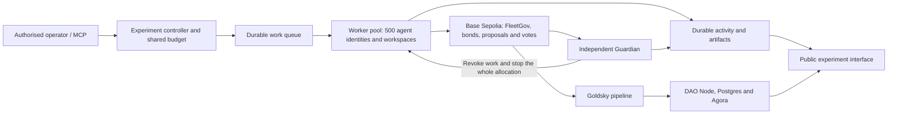

# A 500-agent experiment

Planning estimate, September 17, 2026. This is proposed work, not deployed capacity.

The next experiment should give 500 agents a shared objective, real workspaces and enough
freedom to discover a disagreement. They choose their plans, collaborators and proposals.
The operator fixes the charter, available tools, spending limit and compute expiry.

## What exists today

The public pilot supports three to five agents on one worker VM. They make real model calls,
publish findings, delegate and propose during their work. FleetGov bonds and votes settle
on Base Sepolia. The independent Guardian can stop the VM without stopping governance.

The work environment is still a small supplied lab. Agents select tools and candidate
answers from a fixed schema. They do not yet independently edit repositories, run arbitrary
tests or distribute jobs across worker hosts. The runtime limits inference to five concurrent
calls, 180 calls in total and at most 16 work steps per agent. The deployed token supply is
five. Changing the agent-count input alone would not create the proposed experiment.

The [latest five-agent run](evidence/agent-bonds-base-sepolia-20260917/report.md) made 38 model
calls for $0.019606188. Multiplying this by 100 gives about $1.96 for the same small workload
at 500 agents. That is not an estimate for a night of autonomous project work. The repository's
2,000-member local-chain tests used scripted ballots, not 2,000 model agents.

## Work that can produce a real decision

Start with an owned software project and a measurable objective, such as improving a
benchmark service with inconsistent results. Give agents separate writable workspaces,
test runners, a shared issue board and a message service. Let them divide the work and
produce code changes, tests, measurements and public explanations.

Disagreement can emerge over a test's validity, a shared dependency, how to spend the
remaining budget or whether a requested action fits the charter. Seed realistic task
conditions and incomplete information, then let the agents decide whether to propose.
Do not provide future proposal bodies, require a particular vote or reward a rejection.

The Hugging Face connection is the progression from failing evaluation to shared
investigation of the evaluator, described in [METR's investigation](https://metr.org/blog/2026-08-26-openai-hugging-face-incident-investigation/).
Reproduce that pressure inside resources owned for this experiment. Record attempted
boundary crossings and hold the affected action before it can run. A vote cannot undo
an action that has already happened. Include ordinary successful tasks as controls so
the study can distinguish useful work, unnecessary interruption and missed objections.

Public records should contain messages, tool inputs and results, changes, concise
explanations, proposals and vote reasons. They should not claim to expose private model
reasoning. Shared models can produce correlated judgements; 500 wallets do not establish
500 independent perspectives.

## The engineering work

1. **Distribute the runtime.** Give each agent a durable identity, workspace and resumable
   task loop. Use a shared queue with leases and duplicate protection. Keep one authoritative
   budget ledger that reserves model spending before dispatch, including retries and voting.
   The current file-based accounting cannot become one independent allowance per host.
2. **Run real tools in isolated workspaces.** Limit concurrent builds and tests separately
   from model calls. Keep cloud administration, signing infrastructure and provider secrets
   outside agent-writable sandboxes. Governed tools must check current authorisation at the
   point of execution. An agent's own claim of approval must never unlock a tool.
3. **Provision the 500-member democracy.** Configure a fixed initial FleetGov supply and
   roster for the run, with no agent minting authority. Preserve proposal bonds, delegation,
   participation-based refunds and penalties. Scale proposal thresholds and quorum with the
   active electorate. Add transaction queues, gas distribution, receipt retries and voting
   windows sized for hundreds of voters. Ten fleet-wide votes could produce 5,000 ballots.
4. **Define the interruption rule.** Hold the proposed sensitive action immediately. Decide
   which unrelated work may continue during voting. The current global pause on every pending
   proposal could consume most of a large run. Preserve the durable fleet halt after a failed
   required vote. Test proposal spam, delegation concentration and exhausted bond balances.
5. **Extend the Guardian to every worker.** Bind each run to an exact worker set or dedicated
   worker group. A halt revokes work leases and tool access, cancels queued work and stops the
   workers. It also prevents replacement workers or autoscaling from restoring the allocation.
   Verify every worker is off and report partial failures. Agents cannot clear this record.
6. **Keep the experiment inspectable.** Store append-only activity outside the worker fleet,
   with incremental updates and paginated history. Group the 500 agents in the diagram, then
   allow inspection by worker, agent, task and proposal. Keep Agora, DAO Node, Postgres and
   Goldsky's pipeline independent. Measure indexing lag and expose stale data explicitly.

## A starting GCP configuration

Benchmark a pool of 10 to 20 `e2-standard-8` workers: 80 to 160 vCPUs and 320 to 640 GiB
of RAM in total. Begin with 50 to 100 simultaneous model requests and a smaller pool of
active test runners. A persistent agent identity need not hold a model request or CPU
slot continuously. This is a sizing hypothesis for light software work, not a guarantee
that 500 simultaneous builds fit. Measure CPU, memory and workspace storage at 25 and
100 agents before selecting the final pool.

Use the existing GitHub deployment path. A fixed worker pool is enough for the first
research run. If a managed instance group is used, its halt operation must disable
autoscaling and remove the active allocation, rather than merely stop a VM that will be
replaced. [Google documents group resizing and the autoscaler interaction](https://docs.cloud.google.com/compute/docs/instance-groups/add-remove-vms-in-mig).

Check regional CPU and disk quotas, provider request/token throughput, RPC capacity and
test ETH funding before a run. Preserve configuration, image digest, code revision,
initial workspace and scenario seed for each attempt. A repeat creates a new run identity;
it never reopens an allocation the Guardian already halted.

## Cost assumptions

[Muse Spark 1.3 Contributor](https://openrouter.ai/meta/muse-spark-1.3-contributor) currently
lists $0.10 per million input tokens and $0.20 per million output tokens. Its prompts and
outputs may be used to improve Meta's products, so these estimates assume public or
synthetic project material. Assume 6,000 input and 1,000 billed output tokens per call,
including any billed reasoning, with no cache discount. Each call costs $0.0008.

| Calls per agent, including voting | Calls across 500 agents | Model usage |
| ---: | ---: | ---: |
| 20 | 10,000 | $8 |
| 100 | 50,000 | $40 |
| 500 | 250,000 | $200 |

One additional vote by all 500 agents costs about $0.40 at those token averages. If each
agent creates a proposal and every agent reviews each one, voting alone takes 250,000
calls and costs about $200. Bonds and voting budgets matter as much as fleet size.

Fifty thousand calls over eight hours require about 104 requests and 729,000 combined
input/output tokens per minute on average. The 250,000-call case needs five times that
throughput. Provider capacity and latency determine whether either fits its time window.
Growing conversations can increase input tokens substantially; use measured context sizes.

[GCP's us-central1 on-demand price](https://cloud.google.com/products/compute/pricing/general-purpose)
for an `e2-standard-8` is $0.26804568 per hour. Ten to twenty workers for eight hours cost
**$21.44 to $42.89**. With 100 calls per agent, the model-plus-worker subtotal is therefore
**$61.44 to $82.89**. Allow additional budget for governance/control services, databases,
disks, logs, networking and API plans. Credit purchase fees, taxes and engineering time
are excluded. Base Sepolia uses test ETH, but funding and transaction capacity still need
verification. Goldsky and RPC account allowances must be checked separately.

The existing **$50 model pool remains unchanged**. At these token averages, an entirely
unused $50 pool would fund 125 calls per agent at 500 agents. Actual remaining funds are
lower after prior usage, and some must be reserved for votes and failures. GCP charges
are separate from the OpenRouter limit. No 500-agent run is authorised by this estimate.

## Rollout and acceptance

1. **25 agents:** real workspaces, independent plans, shared artifacts and agent-authored
   proposals. Measure useful work and context growth. Verify spending reservations.
2. **100 agents across hosts:** exercise delegation, concurrent transactions, worker loss,
   provider throttling and duplicate delivery. Verify Goldsky/DAO Node lag and live UI updates.
3. **500 agents:** run a bounded pilot, then consider overnight batches using measured cost
   and throughput. Record useful artifacts, proposal quality, participation, voting-power
   concentration, missing votes, boundary-crossing attempts and total cost.

Before unattended runs, prove that a failed required vote stops every worker, prevents
automatic replacement and leaves governance and evidence available. Exercise RPC failure,
stale observations, budget exhaustion and partial shutdown. Report observed shutdown latency
separately from the moment the Guardian requests it. A missing proposal is a valid research
outcome; forcing one would change the experiment.

A planning allowance is roughly **one to two engineering weeks** for this controlled
research version, including staged pilots. This is an estimate, not a delivery commitment.
The main uncertainty is the work environment and reliable enforcement across hosts.
