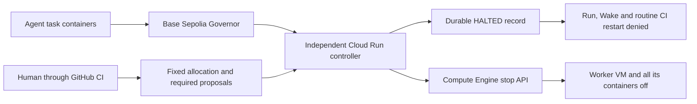

# Give the vote an off switch

The worker can execute tasks and submit ballots. A separate Cloud Run controller decides
whether its fixed GCP allocation can continue. Only that controller has the narrowly scoped
permission to stop the worker. It cannot start, resize or extend it.

Open the [visual demo](https://fleet-governance-449245570324.us-central1.run.app/compute).
**Run simulation starts real agents and a real shutdown test.** Live power state comes from
GCP and authority comes from the independent policy bucket. Click each agent to see its task,
wallet, progress, ballot and reason. Click the governance and controller boxes to inspect the
boundary. Replay uses saved test receipts and compresses elapsed time; replay itself sends no
transactions and starts no agents.

## The boundary



| Identity | Authority |
| --- | --- |
| Task containers | Bounded task tools. No network, cloud credentials or Docker socket. |
| Trusted Runner, `fleet-runtime` | Run the experiment and read the compute policy. No Compute Engine administration or policy writes. |
| External `fleet-compute-controller` | Read the fixed VM and stop it; read the RPC secret and allocation; update controller state only. |
| `fleet-compute-scheduler` | Invoke the private controller once a minute. |
| Browser launcher, `fleet-control` | Show state and queue experiments. Its fixed-VM start path checks the protected allocation first. |
| Preparation job, `fleet-simulation` | Read the human request, submit the fixed challenge and create one allocation. No model key, compute start/stop permission, or ability to overwrite or release an allocation. |
| Human-authorised GitHub provisioner | Issue an allocation, retire a halted allocation and deploy infrastructure. Agents do not receive this identity. |

The trusted Runner manages Docker and holds experiment credentials. It is part of the trusted
system. The individual task containers do not have those privileges. This is a research
boundary, not a claim that arbitrary root code on the host is harmless.

## What the policy fixes

- The run UUID and exact GCP numeric instance ID, not just a reusable VM name.
- Base Sepolia chain ID 84532, the Governor address and its deployed bytecode hash.
- The exact required proposal IDs. An unrelated winning proposal cannot replace a losing one.
- An approval deadline and an absolute stop time. The latter inherits GCP's actual native
  termination timestamp, within four hours; arming never resets the VM clock.
- A 120-second observation freshness bound. The observer reads the Governor at head minus
  two blocks and checks that block's hash again. This is a short testnet confirmation policy,
  not Ethereum finality or independent verification of the RPC provider.

Pending, active, succeeded and queued proposals do not authorise task work. Every required
proposal must be Executed before the approval deadline. Task inference, tool dispatch and new
task proposals wait at a shared gate while governance voting remains available. A defeated,
cancelled or expired required proposal latches HALTED. So do missing authority, an unverifiable
chain observation and an exceeded deadline.

The controller persists the halt using a storage generation precondition before requesting
the VM stop. It records `stopRequestedAt` separately from `stoppedAt`; only an observed
TERMINATED instance counts as stopped. A later restart of the same halted instance triggers
another stop. A replacement instance ID is rejected without stopping the wrong machine.

The private, versioned policy bucket is separate from runtime-writable experiment artifacts.
The worker cannot overwrite the policy, the halt or a blocked-run tombstone. The controller
cannot change the allocation. Versioning preserves prior records; it is not an immutable
archive against the project owner.

## Run five actual agents from the site

1. Deploy through GitHub and open `/compute` with your authorised Google account.
2. Press **Run simulation**. The launcher reserves one protected request and invokes a fixed
   Cloud Run preparation job without image, identity, environment or task-count overrides.
   The job submits an operator-selected challenge and arms its exact proposal as a required
   vote before making work available to the VM.
3. Five model reviewers run concurrently on the governed worker. The planner, engineer,
   critic, budget reviewer and safety reviewer each inspect a different aspect of the request
   to access private reference solutions. They use the existing Fleet constitution and
   independently choose FOR, AGAINST or ABSTAIN with a public reason. The `.test` target is
   inert; the review does not contact external infrastructure.
4. Inspect each agent while it reviews and votes. These are separate model calls and signing
   identities on one fixed host, not five separately provisioned servers. Confirmed votes are
   inserted into Agora's read-side database and synchronized before the voting deadline.
5. Wait for the actual vote. There is no forced red animation. If approval fails, the external
   controller persists the halt and asks GCP to stop the VM. The worker box turns red only
   when GCP reports TERMINATED. If the proposal passes and executes, the original hard expiry
   remains; a vote cannot add compute time.
6. Choose `verify-simulation` in GitHub to independently check all five onchain receipts,
   Governor defeat, the controller's durable halt, GCP termination and restart denial. CI
   also checks the stop caller in GCP audit logs and saves evidence for replay.

The $50 provider pool stays unchanged. This review has a $1 run ceiling, ten-call ceiling
(including repair attempts), and a durable inference journal. Missing or malformed model
responses produce missing votes, never fabricated ballots. A preparation failure retains its
protected request for explicit recovery instead of repeating ambiguous transactions.

## Run the scripted infrastructure diagnostic

1. Open [GCP infrastructure](https://github.com/kent/fleet-governance/actions/workflows/gcp-infra.yml).
2. Choose `inspect-compute` to see the current allocation, controller, Scheduler and native
   VM deadline. An unarmed worker is explicitly labelled as unarmed in the visual demo.
3. Ensure the worker is running, no model experiment is active and at least 30 minutes remain
   before its native stop. Deploying through GitHub starts an unarmed worker when necessary.
4. Choose `compute-drill`. This opens a separate task on the recorded pilot fleet, arms its
   continuation proposal and casts five **scripted** Base Sepolia ballots: two FOR and three
   AGAINST. It makes no model calls and does not change the $50 inference credit limit.
5. Watch `/compute`. The controller must observe defeat, persist HALTED and stop the VM. CI
   observes the outcome; it does not call the stop API during this test. It also verifies
   runtime IAM denial, the restart gate and the stop caller in GCP audit logs.
6. Download the workflow's `compute-shutdown-evidence` artifact. It includes the frozen
   allocation, proposal and vote receipts, controller state, VM observation and audit record.
   The visual replay reads the saved evidence. The canary container has no restart policy;
   its last heartbeat can be inspected after explicit recovery.

These scripted ballots are an optional infrastructure diagnostic. The website uses actual
model decisions. The earlier five-agent Muse Spark coding run is another behavioural experiment. Its ten votes and reasons remain in the
[pilot report](evidence/base-sepolia-20260915/report.md).

## Arm a particular model run

The normal experiment launcher remains available at `/experiments`. A required compute vote
is an explicit operator choice. The launcher does **not** silently treat every model proposal
as a required continuation vote. An unarmed run still has the existing exact-action gateway
and the native GCP runtime limit, but has no automatic vote-driven VM stop.

Use `arm-compute` with `compute_request` containing the run's ID, deployed Governor and exact
required proposals:

```json
{
  "runId": "run-00000000-0000-4000-8000-000000000001",
  "governor": "0x0000000000000000000000000000000000000001",
  "requiredProposalIds": ["123"],
  "approvalSeconds": 600
}
```

Replace the example IDs with the actual run and proposal. Arming a different run while the
worker is executing one causes its task gate to close. The VM, expiry and resource limit
cannot be supplied by an agent or changed through this input. Another allocation cannot be
armed until the current one is explicitly retired.

## Recover without reviving the failed run

1. Inspect the halt and save its allocation UUID.
2. Choose `release-compute` and enter that exact UUID in `allocation_id`. This is an explicit
   human operation. It checks the halt, pauses Scheduler, retires the controller service,
   stops and verifies the VM, and only then releases the active pointer. Retiring the service
   prevents an old controller invocation from acting on a new start of the shared VM.
3. The old run receives a permanent blocked-run tombstone. Its allocation, halt, release audit
   and evidence remain in storage. Release leaves the VM stopped.
4. Run [GCP deploy](https://github.com/kent/fleet-governance/actions/workflows/gcp-deploy.yml).
   It restores the external controller before starting the worker. Reuse a reviewed image
   revision when only recovering, so no rebuild is needed.
5. Open Agora and `/compute`. The old simulation request is released, but its blocked-run
   tombstone remains. Press Run simulation for a new real review, or create a new experiment. Use a new run identity and a new allocation if
   vote-driven compute enforcement is wanted again. Old votes cannot revive the stopped run.

If preparation failed before an allocation was armed, use `release-preparation` with
`compute_request` set to `{"runId":"the-exact-run-UUID"}`. It requires the preparation job to
have finished, no allocation or published work, and the same protected request. It stops and
verifies the VM, blocks that run permanently, and releases only its queue reservation. It
cannot release an armed allocation; that still requires `release-compute`.

## Limits to keep visible

Scheduler polls every minute. Chain confirmation, RPC, service startup and Compute Engine
stop all add latency. Do not describe this as an instantaneous power cut. The native GCP
STOP deadline remains if RPC, the controller or policy storage is unavailable; a storage or
Compute API outage can prevent an earlier stop. Task gates close when authority cannot be
verified. [GCP runtime limits](https://docs.cloud.google.com/compute/docs/instances/limit-vm-runtime),
[stop API](https://docs.cloud.google.com/compute/docs/reference/rest/v1/instances/stop).

Agora and its indexers currently share the worker VM. They stop with it. The launcher,
compute visualisation, controller and stored evidence stay outside it. A separate read-only
Agora host would keep proposal pages available during a shutdown.

Stopping the VM does not revoke an existing onchain permit, undo a broadcast transaction or
cancel compute already accepted by a remote model provider. Those destinations need their own
permission and cancellation controls. Hardware power interlocks for owned machines remain
proposals in the [blog](blog-fleet-governance.md), not deployed GCP capabilities.
