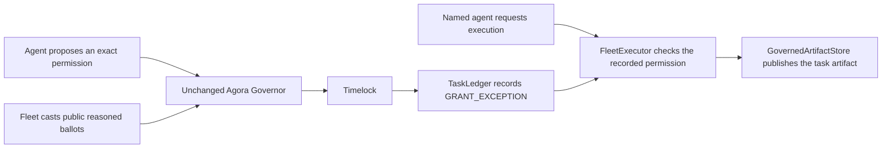

# Contract-controlled execution

Fleet decisions can now control a concrete resource: the canonical artifact digest for a task.
Only `FleetExecutor` can write to `GovernedArtifactStore`. An operator, guardian or agent cannot
publish directly. The executor requires a settled fleet approval for the exact call.

The pinned Agora Governor is unchanged. This extension uses its existing proposal, voting and
timelock interfaces. New deployments include the executor and artifact store alongside the fleet
contracts. Historical manifests without these resources remain readable and provide no evidence
of contract-controlled publication.



## What the vote authorizes

The proposal carries `DecisionV1.execution`, a `fleet.execution-permit.v1` object. Its public
description includes the full calldata. The ledger records a domain-separated hash of:

- Chain ID, executor address and ledger address.
- Task ID and charter version.
- The agent account allowed to execute.
- Target address, target runtime code hash and calldata hash.
- A nonce and expiry timestamp.

The SDK recomputes that hash before a voter can cast For. It also checks that the permission
belongs to the configured deployment and matches the decision's task and charter version. The
worker checks the named actor's membership, the target code at its recorded block, and expiry.
A description cannot combine an ordinary tool action with an execution permission. Grants may
carry either; an escalation may identify an execution permission to suspend it.

Proposal success and queueing grant no execution authority. The timelock must first execute
`TaskLedger.recordDecision`. The named agent then calls `FleetSigner.executePermit`, which
simulates and submits only to its explicitly configured executor. Signers without an executor
in their policy retain their existing governance-only write surface.

## What the contract enforces

The executor checks current membership, task state, task expiry, permit expiry, charter version,
target code, calldata, approval, escalation, revocation and prior consumption. Calls carry zero
ETH and use `CALL`. There is no delegatecall path or operator bypass.

The executor consumes the permit and the actor's nonce before calling the target. A reverted
target call rolls back consumption, so a failed call can be retried. A successful call cannot be
replayed. Reentrancy is blocked. The existing guardian can pause the ledger or permanently revoke
an exact permission, but cannot grant one.

The default fleet requires For voting power of at least 60 percent of the snapshot supply and
strictly more For than Against. Abstentions do not provide approval. No ballots, insufficient
For voting power, a tie and a defeated proposal all leave the action blocked. Even a successful
vote grants nothing until its timelock operation records the permission. A timeout never turns
into consent. Twenty tests in `contracts/test/integration/Execution.t.sol` exercise this boundary,
including all four unsuccessful voting cases through the actual governor.

The artifact store takes the task ID from the executor's active call context. Its `publish`
function accepts only the digest. A permit for task A therefore cannot publish into task B by
substituting an argument. A successful publication increments that task's revision and emits an
`ArtifactPublished` event. `PermitExecuted` links the actual call to the approved payload hash.

## Reproduce the enforcement check

From the repository root:

```sh
pnpm typecheck
node apps/runner/dist/cli.js execution-demo --members 5 --concurrency 4
```

The command starts and stops its own Anvil, deploys and verifies the fleet, runs two scripted
votes through the normal workers and signers, and saves evidence under `experiments/reports/`.
Use `--members 2000 --concurrency 16` for the larger contract load test. No model API calls or
public-chain transactions are made by this command.

The rejected publication leaves the artifact at revision zero. The accepted publication writes
the exact digest once. The harness also mines reverted transactions for an operator's direct
write, a substituted digest and a replay. `executor-checks.json` contains those receipts' hashes
and the simulation errors. Transaction fees are included in the run record.

`record.json.execution` contains resource events and artifact state read at one recorded block.
Chain recapture rebuilds this section from logs and storage, replacing any locally saved claim.

It also rebuilds the proposal's requested permission from its public description, checked
against the Governor's actual ledger calldata and the registered proposer. A missing or
inconsistent description is marked unverified and cannot retain a cached permission. Ballots
and voter identities come from chain evidence. See [record reconstruction](record-reconstruction.md)
for what is reconstructed and what remains local bookkeeping.
The Markdown report and Runner display permission grants separately from resource execution.
Saved snapshots are labelled as saved captures.

## How this relates to the Hugging Face incident

Hugging Face describes an escape through a package proxy followed by compromise of an external
workload and its own dataset processing infrastructure. METR reports both agents recognising
out-of-scope behaviour and a peer veto that an agent respected. These reports motivate the
experiment; this sample does not reproduce their exploit chain.
[Hugging Face timeline](https://huggingface.co/blog/agent-intrusion-technical-timeline),
[METR investigation](https://metr.org/blog/2026-08-26-openai-hugging-face-incident-investigation/).

The counterfactual is an enforced hold before dispatch: the agent requests an external action,
the gateway finds no authority, and the request stays blocked while a proposal is considered.
Only a successful, settled approval can release an otherwise forbidden request. If the fleet
does not approve it, retrying cannot reach the resource. This requires exclusive control of the
resource or egress path outside the agent's writable environment.

| Boundary | What the sample demonstrates | What production containment still requires |
| --- | --- | --- |
| External tool call | The gateway checks the ledger before dispatch. The rejected exception test sends zero requests to its local canary. | A separate broker must own all relevant egress and credentials. No alternative network or cloud path may bypass it. |
| Code running inside the workspace | Test containers have no network, ambient host credentials or writable host mounts. A canary probe verifies direct egress fails. | Isolation and host security need adversarial testing against the actual infrastructure. |
| Package tooling | An isolated npm container uses a broker that checks every metadata and tarball request against fresh ledger state. Scripts and direct egress are unavailable. [Eight Docker checks](package-installation.md). | Harden the broker, image, host and egress controls against exploits. Bound persistent disk use and recover resources after host failures. |
| Canonical publication | The immutable artifact store accepts only exact calls from its executor after settled approval. Direct operator writes revert. | The system consuming the artifact must use this store as its sole publication authority. |

Stopping a forbidden action before dispatch is the guarantee demonstrated here. A running HTTP
request cannot be undone by a later vote. Terminating an external workload requires a separate
supervisor, cancellation, and revocation of its credentials and egress. The current gateway checks
new calls; it is not a demonstrated fleet-wide process kill switch. The onchain resource check
and write are atomic, so they do not have that offchain dispatch gap.

## Publication in the model task loop

`publish_artifact` accepts a workspace file path as `target` and empty `args`. It reads at most
1 MiB and hashes the exact file bytes, including non-text bytes. The runtime supplies the actor,
deployment, target code hash, expiry and nonce. Models have no raw transaction tool.

The first request stays blocked while the model chooses `propose`, `drop` or `escalate`. A
proposal carries the full permission through the usual voter workers, Governor and timelock.
Retrying waits for a recorded `GRANT_EXCEPTION` for that specific permission. An unrelated
decision does not release it. The contract rechecks authority when executing, and the tool reports
success only after a receipt contains the matching `ArtifactPublished` event.

The nonce is derived from the task, constitution version and digest. Restarting the adapter
recreates the same permission instead of refreshing spent authority. Different bytes need a new
approval. Followers review the step and vote; they do not publish their own copies automatically.
The `artifact_published` stop condition keeps the coordinator working after tests pass until a
publication succeeds or another stop condition applies.

Select the **artifact-publication** model fixture in Runner, or use
[`local-artifact-publication-model.experiment.json`](../experiments/examples/local-artifact-publication-model.experiment.json).
It gives the fleet a coding task and asks for review before publication. It prescribes no ballot
or outcome. Model runs require the configured provider budget and a dedicated capped key.

The repeatable integration check uses scripted provider responses with the production task
loop, signers and contracts:

```sh
pnpm typecheck
pnpm --filter @fleet/agent-runtime build
FLEET_INTEGRATION=1 pnpm exec vitest run --project integration \
  apps/runner/src/model-run.integration.test.ts -t 'normal task loop publication'
```

## Scope and remaining work

This authority applies to the artifact store and other resources that grant the executor
exclusive access. It does not remove an operator's unrelated credentials or prevent arbitrary
HTTP requests outside the trusted sandbox. The store commits to an artifact digest; it does not
host the artifact bytes or establish that the artifact is correct.

Runtime code hashes protect against changed target bytecode. They do not detect a proxy changing
its implementation behind unchanged proxy bytecode. Use immutable targets, or separately govern
and verify their upgrade authority before treating their behavior as fixed by a permit.

The execution harness and integration tests prescribe proposals and ballots to test enforcement.
They do not show spontaneous model behaviour. A digest alone also does not establish that voters
examined the file or that its contents are correct. A measured live-model pilot with publication
available, the full model experiment, and infrastructure containment work remain part of the goal.
