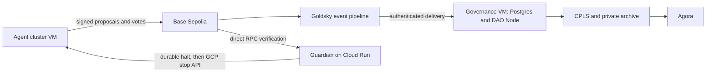

# Governance stays on when the agents stop

Only the agent cluster receives the Guardian's kill signal. Reading the vote should never
require turning the agents back on.

| Component | Where it runs | What it can do |
| --- | --- | --- |
| Agent cluster | `fleet-research`, its own GCP VM | Run bounded agent tasks and sign testnet votes. Cannot provision or restart compute. |
| Governance | `fleet-readside`, a separate VM with Postgres on a persistent disk | Run Agora, DAO Node, CPLS and the event receiver. Cannot sign agent votes or control compute. |
| Event pipeline | Goldsky's managed service | Deliver the fixed Fleet token and Governor events from Base Sepolia. |
| Guardian | Independent Cloud Run service | Verify the exact onchain proposal and stop `fleet-research`. Cannot start it or stop `fleet-readside`. |

The governance VM is intentionally small: two vCPUs, 8 GB RAM and a persistent database
disk. Postgres shares that VM for this research demo. It is a separate database from the
agent worker's data, not a highly available managed database.

## Pipelines, not subgraphs

[`fleet-base-sepolia.yaml`](../infra/goldsky/fleet-base-sepolia.yaml) defines a Goldsky Turbo
pipeline using `base_sepolia.raw_logs`. Its source filter restricts backfill to the deployed
Fleet token and Governor from block 46,858,912. There is no subgraph in this read path.

1. Goldsky sends raw events and change operations to an authenticated delivery endpoint.
2. The receiver validates the contract and event shape, checks the block hash against the
   RPC, then commits the raw log to Postgres. Duplicate deliveries use the same identity.
3. DAO Node reads those local logs through a small read-only JSON-RPC adapter. Historical
   indexing no longer scans thousands of ten-block RPC windows on every restart.
4. The receiver decodes `VoteCast` into CPLS's existing `fleet.votes` table. DAO Node owns
   the governance projection. CPLS combines that projection with the ballot rows and
   writes the private archive that Agora reads.
5. A host timer checks for new deliveries every 15 seconds and requests an archive refresh.
   DAO Node polls the local event store every three seconds. CPLS's minute scheduler also
   updates proposal state as voting deadlines pass.

The independent archive uses `fleet-governance-history-449245570324`. The agent runtime
has no write permission to that bucket. Old worker services cannot overwrite the public
history if the worker is started for a later authorised run.

Goldsky delivery is [at least once](https://docs.goldsky.com/turbo-pipelines/delivery-guarantees).
The receiver acknowledges only after committing its database transaction. It applies
deletions, rejects replayed orphan blocks and retries when the RPC has not caught up with
a rollback. A confirmed reorg triggers a DAO Node restart from the local canonical log
store before the archive refresh. This does not make the research deployment highly
available; a host outage can still interrupt viewing until that host recovers.

## Deploy and inspect through GitHub

1. Run **GCP infrastructure**, action `provision-readside`, for Terraform resources and
   managed credentials. Its plan guard rejects changes to the governed worker.
2. Run **GCP deploy Fleet demo**, with `history_only=true`. This builds pinned images,
   deploys the independent receiver, applies the Goldsky pipeline, waits for historical
   ballots, then starts Agora and switches the public site to the governance VM.
3. Use `inspect-history` for redacted service logs and ingestion counts. Use
   `inspect-compute` separately to check the Guardian and agent VM.
4. Verify `/info`, `/proposals` and the proposal's reasons while `fleet-research` is
   `TERMINATED`. A stopped agent VM is no reason to skip those checks.

Goldsky API access and the webhook credential live in GCP Secret Manager. The delivery
transport has no GCP resource permissions. Signing wallets and model credentials are
never attached to the governance VM. Neither deployment nor repair clears a halted
allocation or launches another model run.

The pipeline currently follows the fixed Base Sepolia pilot contracts in
[`base-sepolia-pilot.json`](../experiments/compute/base-sepolia-pilot.json). Deploying a
different fleet requires updating the pipeline filter and governance configuration
together. The older generic experiment runner still has a worker-local read side; it
does not publish into this independent pilot archive.

The Guardian does not trust Goldsky, DAO Node or Agora to authorise execution. It reads
the exact proposal states from Base Sepolia directly. A broken indexer can delay the
display. It cannot turn a rejected vote into permission to run.
